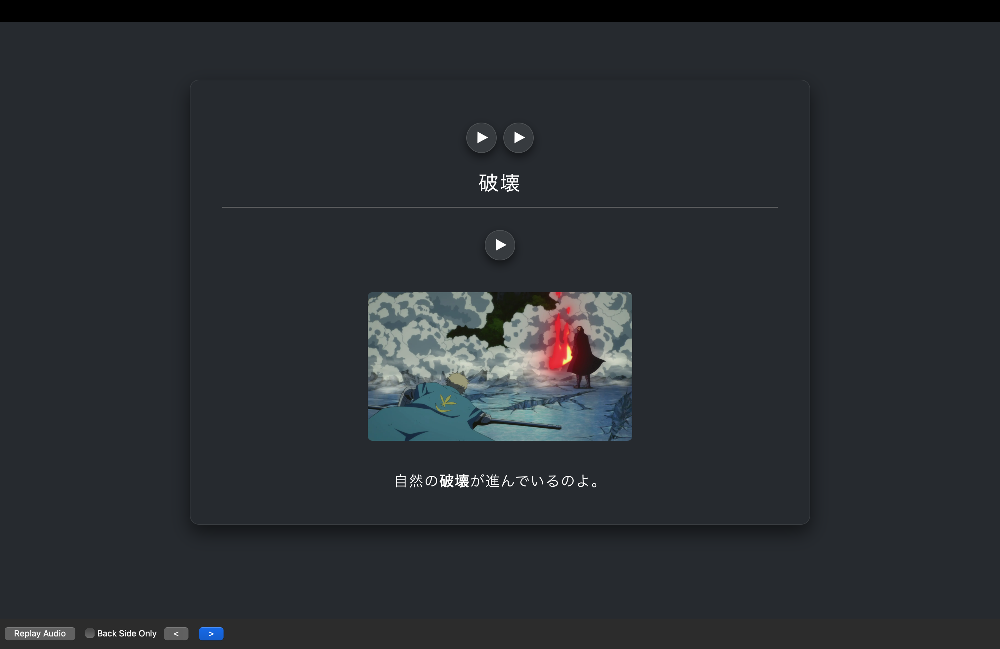
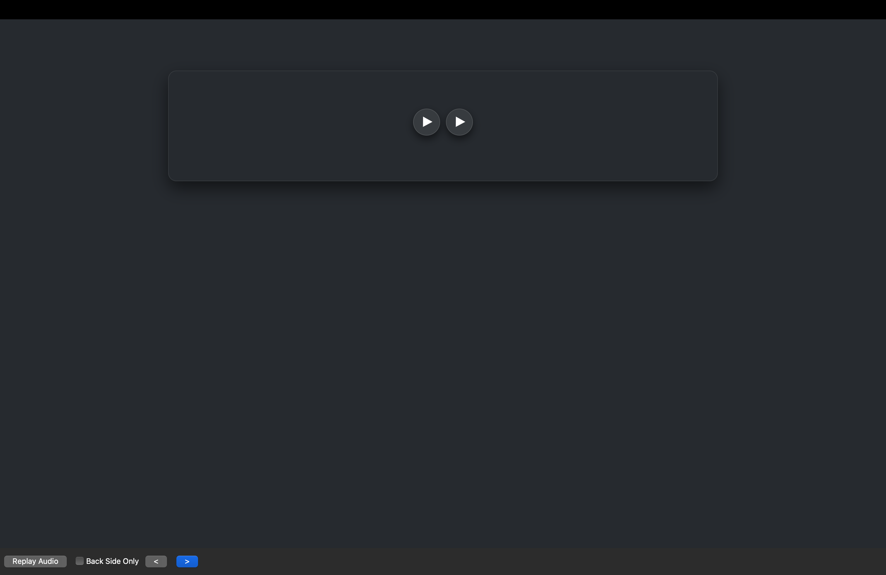

# Anki Luxury Design ✨

A clean, minimalist **luxury-style** card design for Anki flashcards.
Built using **HTML and in-app CSS**, fully compatible with Anki’s card editor.

This design focuses on readability, spacing, and a premium visual feel,
while staying simple and distraction-free.

---

## ✨ Features
- Minimalist luxury aesthetic
- Two variants:
  - **With optional text** (guided learning)
  - **Without optional text** (clean immersion)
- No external dependencies
- Works with any Anki deck
- Desktop and mobile friendly

---

## 📂 Versions

### 🔤 With optional text
Located in `with-optional-text/`

This version includes additional helper text on the front and back cards.
I personally use this variant because I am still learning **kana** and want
a **gradual exposure** to symbols instead of full immersion from day one.

**Files:**
- `front.html`
- `back.html`

**Preview:**

**Front**

**Back**

---

### 🧘 Without optional text
Located in `without-optional-text/`

A clean, distraction-free version without any extra text.
Ideal for advanced learners or full immersion study.

**Files:**
- `front.html`
- `back.html`

**Preview:**

**Front**

**Back**

---

## 🛠️ How to use

1. Open **Anki**
2. Go to **Browse → Cards → Cards…**
3. Choose the version you want:
   - `with-optional-text`
   - `without-optional-text`
4. Copy:
   - `front.html` → **Front Template**
   - `back.html` → **Back Template**
   - `styling.css` → **Styling**
5. Save and enjoy ✨

---

## 📝 Notes
- The design is intentionally simple to reduce cognitive load
- You can freely tweak fonts, spacing, or colors
- Feel free to adapt this design to your own decks

---

## 📄 License
This project is licensed under the **MIT License**.
You are free to use, modify, and share it.

---

⭐ If you like this design, feel free to star the repository.
